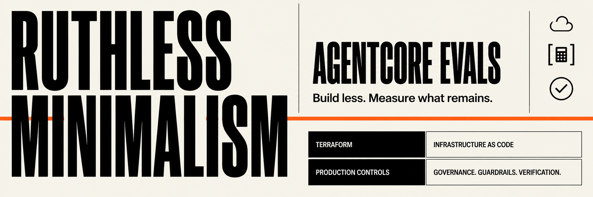

# AgentCore Evals


**A deliberately small, eval-first build of one production-shaped Strands agent on Amazon Bedrock AgentCore: current weather through a governed Gateway, plus a direct calculator.**

This repository is the sequel to [aws-ai-evals](https://github.com/rhprasad0/aws-ai-evals). Weeks 1–8 build and close the reusable evaluation foundation; Weeks 9–16 use it once on a Terraform-owned vertical slice with real credentials, policy, reliability, observability, CI, a capped hosted demo, and a recovery drill.

The curriculum is [`LEARNING_PLAN.md`](LEARNING_PLAN.md). The weekly guides are indexed in [`docs/weeks/`](docs/weeks/README.md). The hosted result is a learning demo with inspectable receipts, not a production-readiness or safety claim.

> **Why the plan was rewritten.** Weeks 1–8 produced a strong evaluation foundation, but the original back half had expanded into a five-tool chain, large labeling/judge programs, multi-agent work, and continuous managed evaluation. That breadth made the curriculum harder to finish and obscured the AgentCore production boundaries it was meant to teach. The rewrite applies ruthless minimalism: one understandable vertical slice, one owner per boundary, and receipts tied to real operations.
> **Major changes.** Weeks 1–7 are frozen as history and Week 8 closes the existing harness; Weeks 9–16 now use eight preregistered cases and one frozen judge contract, Terraform-only durable infrastructure, Identity/Gateway/Policy with distinct native and proxy guardrails, a bounded weather retry/shared-breaker path, immutable STAGING→PROD releases, same-evidence managed evaluation with manual OIDC CI, a capped hosted demo, and separate Runtime-version and HCL recovery drills.
## The system being built

1. **Exactly two capabilities:** current weather and calculator. Dropped: the five-tool/write-action path, labeling or judge platform, repeated/nightly managed campaigns, Memory/multi-agent work, and optimizer trial.
2. **Terraform owns all final durable infrastructure:** remote state, AgentCore, IAM, observability, public edge, and the existing Budget.
3. **AgentCore Identity owns the OpenWeather credential:** Gateway injects `appid`; the Runtime never receives the key.
4. **Policy and guardrails have named scopes:** deterministic AgentCore Policy authorization plus Policy rules using probabilistic Bedrock Guardrail checks govern Gateway traffic; a separate Bedrock Guardrail protects public proxy input/output.
5. **One tiny same-evidence evaluation:** six eligible synthetic STAGING traces go to human expectations, one custom judge, and two managed built-ins; two denial rows stay in separate boundary metrics.
6. **Telemetry supports operations:** CloudWatch traces, a small dashboard, one duration alarm, one error alarm, and SNS notifications.
7. **The public edge is capped:** private S3 UI through CloudFront, WAF rate rule, IAM-protected Lambda Function URL origin, atomic 10-Runtime-calls/day cap, and an immediate kill switch.

## Final vertical slice

```text
Browser
  ↓
CloudFront + WAF
  ├─ private S3 UI via OAC
  └─ `/api/*` → Lambda Function URL via OAC/SigV4
       ├─ proxy Bedrock Guardrail (input/output)
       ├─ DynamoDB daily cap + enabled flag
       └─ AgentCore Runtime PROD endpoint
            ├─ direct calculator
            └─ narrow weather wrapper
                 ├─ deadline + one retry + shared breaker
                 └─ AgentCore Gateway
                      ├─ deterministic Policy allow/deny
                      ├─ Policy rules using Bedrock Guardrail checks
                      └─ OpenWeather target + Identity credential injection

CloudWatch → dashboard/alarms → SNS
Terraform Budget → $100 monthly limit + direct email alerts
STAGING spans → custom judge + AgentCore Evaluations
```

## Evidence model

- The existing broad baseline is the 62-case deterministic weather projection.
- The final vertical slice adds eight preregistered cases: six behavioral cases eligible for judges and two denial probes. The two infrastructure-denial rows are ineligible because they measure boundary enforcement, not model tool choice.
- Human expectations are frozen before output; the custom rubric is frozen before final Runtime evidence.
- All three judge lanes consume the same six eligible spans from one immutable Runtime version.
- Reports show counts and every disagreement. Eight rows are a worked comparison, not calibrated population evidence.
- Pull-request CI is fixture-backed and cloud-free. One manual GitHub OIDC job performs the metered live comparison.
- Operational anonymous PROD traces are not reused as rich evaluation evidence because public inputs are neither synthetic nor prereviewed; controlled STAGING keeps evaluator inputs scoped and inspectable.

## Prerequisites

- AWS access in `us-east-1` with the required AgentCore, Bedrock, IAM, CloudWatch, Lambda, CloudFront, WAF, DynamoDB, S3, SNS, and Budgets permissions.
- Bedrock model and guardrail access enabled before managed work.
- Terraform `>= 1.11`; HashiCorp AWS provider `>= 6.53, < 7.0`.
- Python 3.13 for the final CodeZip Runtime; `uv` for the repository environment.
- Node.js 20+ and the AgentCore CLI for package/validate/inspect/invoke/evaluation operations only.
- An OpenWeather API key supplied ephemerally to Terraform's write-only credential argument.
- Cost approval before deployment, WAF creation, managed evaluation, or repeated live probes.

## Ownership and recovery

- `infra/terraform/state-bootstrap/` owns the encrypted, versioned, lock-enabled remote-state bucket.
- `infra/terraform/production-demo/` owns the final AgentCore, IAM, observability, and hosted-demo resources.
- Existing `infra/terraform/budget/` owns the account Budget under a separate state key; it is updated, never duplicated.
- Runtime rollback restores the prior approved immutable version in Terraform and applies an endpoint-only plan. Infrastructure recovery restores known-good reviewed HCL/artifact inputs and applies their diff. An old S3 state object is restored only when state itself is corrupt.

## Schedule

| Status | Week | Bounded outcome |
| --- | --- | --- |
| ✅ | [1 — Fundamentals](docs/weeks/week-01-fundamentals.md) | Local toolchain, first loop, architecture, Budget. |
| ✅ | [2 — First agent](docs/weeks/week-02-first-agent.md) | Typed weather tool and explicit failure envelopes. |
| ✅ | [3 — Runtime](docs/weeks/week-03-runtime-deployment.md) | Managed invocation, isolation/IAM evidence, telemetry, teardown. |
| ✅ | [4 — Tool seams](docs/weeks/week-04-tool-integration.md) | Direct, MCP, Gateway, and explicit registration. |
| ✅ | [5 — Contracts](docs/weeks/week-05-tool-contracts.md) | Contracts, manifests, taxonomy, IAM denials. |
| ✅ | [6 — Dataset](docs/weeks/week-06-dataset-validation.md) | 100 reviewed rows, mocks, traces, validators. |
| ✅ | [7 — Specimen](docs/weeks/week-07-specimen.md) | Pinned 62-case weather projection. |
| ✅ | [8 — Harness closeout](docs/weeks/week-08-local-harness.md) | One fixture-backed 62-case baseline and closeout receipt. |
| ✅ | [9 — Human gold](docs/weeks/week-09-human-labeling.md) | Eight frozen expectations: six behavior, two denials. |
| ✅ | [10 — Judge calibration](docs/weeks/week-10-judge-calibration.md) | Provider-free dry run, disjoint judge calibration, then all-six held-out local Strands evaluation. |
| ✅ | [11 — Terraform + Gateway](docs/weeks/week-11-gateway-weather.md) | Remote state, Identity/OpenAPI target, Policy/guardrails, allow/deny receipts. |
| 🚧 | [12 — Reliability](docs/weeks/week-12-reliability-gates.md) | Deadline, one retry, shared breaker, three tests. |
| ⬜ | [13 — Runtime operations](docs/weeks/week-13-runtime-operations.md) | Python 3.13 CodeZip, STAGING/PROD promotion, telemetry and alarms. |
| ⬜ | [14 — Managed eval + CI](docs/weeks/week-14-managed-evaluation-ci.md) | Same-evidence comparison, offline PR gate, manual OIDC run. |
| ⬜ | [15 — Hosted demo](docs/weeks/week-15-hosted-demo.md) | CloudFront edge, proxy Guardrail, cap, kill switch, WAF, $100 Budget. |
| ⬜ | [16 — Incident drill](docs/weeks/week-16-capstone.md) | Alarm, kill, rollback, Terraform recovery, controlled closeout. |

## Progress log

> **Week 1 closed — 2026-07-08.** Local Strands/AgentCore toolchain, first AWS identity agent, architecture notes, and Terraform Budget. Links: [`src/agents/hello.py`](src/agents/hello.py), [`docs/architecture.md`](docs/architecture.md), [`docs/cost-guardrails.md`](docs/cost-guardrails.md).

> **Week 2 closed — 2026-07-09.** Typed current-weather and temperature-conversion tools with offline failure coverage. Links: [`src/tools/weather.py`](src/tools/weather.py), [`src/tools/temperature.py`](src/tools/temperature.py), [`docs/reports/week-02-conversations.md`](docs/reports/week-02-conversations.md).

> **Week 3 closed — 2026-07-11.** CLI/CDK CodeZip deployment, managed execution evidence, latency/cost measurements, IAM inspection, and verified teardown. Links: [`docs/local-vs-agentcore.md`](docs/local-vs-agentcore.md), [`docs/trace-anatomy.md`](docs/trace-anatomy.md).

> **Week 4 closed — 2026-07-12.** Three explicit tools, ambiguity findings, MCP audit, and direct-versus-Gateway seam comparison. Links: [`docs/reports/week-04-ambiguity-battery.md`](docs/reports/week-04-ambiguity-battery.md), [`docs/decisions/0001-explicit-tool-registration.md`](docs/decisions/0001-explicit-tool-registration.md).

> **Week 5 closed — 2026-07-14.** Exact-version contracts/manifests, fail-closed registration, shared binding identity, and disposable Runtime IAM/isolation denials. Links: [`docs/tool-contract-spec.md`](docs/tool-contract-spec.md), [`docs/reports/week-05-runtime-iam-isolation.md`](docs/reports/week-05-runtime-iam-isolation.md).

> **Week 6 closed — 2026-07-16.** Reviewed 100-row corpus, deterministic mocks, canonical trace schema, telemetry mapping, and one offline validation command. Links: [`datasets/synthetic/tool-calling-100.manifest.json`](datasets/synthetic/tool-calling-100.manifest.json), [`docs/telemetry-compatibility.md`](docs/telemetry-compatibility.md).

> **Week 7 closed — 2026-07-17.** Pinned weather-only specimen, two 62-case normalized executions, and a bounded errata review. Links: [`docs/reports/week-07-full-projection.md`](docs/reports/week-07-full-projection.md), [`docs/errata/week-07-dataset-errata.md`](docs/errata/week-07-dataset-errata.md).

> **Week 8 closed — 2026-07-19.** Locked offline Stage B closeout: 57 focused tests passed; 62 projected cases accounted for; 60 evidence-valid traces; two instrument errors; zero gate errors; deterministic JSON/Markdown receipts. Link: [`docs/weeks/week-08-local-harness.md`](docs/weeks/week-08-local-harness.md).

> **Week 9 closed — 2026-07-19.** Reviewed and froze eight human expectations before model output: six behavioral rows eligible for the future judge lanes and two boundary rows explicitly excluded. The checked-in report records the input, gold, and per-expectation SHA-256 digests and the scope limit. Link: [`docs/reports/week-09-human-labels.md`](docs/reports/week-09-human-labels.md).

> **Week 10 closed — 2026-07-19.** The provider-free all-eight-ID gate passed; the frozen six-vector calibration matched 6/6 labels; and the fixture-covered all-six local Strands run matched the custom judge on every behavioral row. Built-in evaluator score/test-pass discrepancies on conversion rows are recorded as evaluator-semantics evidence; no deployed claim follows. Link: [`docs/reports/week-10-judge-contract.md`](docs/reports/week-10-judge-contract.md).

> **Week 11 closed — 2026-07-20.** Terraform-owned remote state and the Identity/Gateway/OpenAPI/Policy boundary were deployed and read back with no drift. Current weather and the local weather→calculator trace succeeded, while Policy denied the forecast probe before target execution. Guardrail-in-Policy evidence remains explicitly deferred by the Terraform provider gap rather than recorded as a pass. Link: [`docs/reports/week-11-production-gateway-boundary.md`](docs/reports/week-11-production-gateway-boundary.md).

## Guardrails

- Terraform is the final infrastructure owner; CLI/CDK deployment is migration history after cutover.
- Never create Terraform/CloudFormation dual ownership.
- Judges are measurements, not truth; six rows do not establish calibration.
- Identity owns the weather credential; no key in source, Runtime environment, Terraform plan, or state.
- Policy authorization and Guardrail-in-Policy checks cover Gateway traffic; the proxy Guardrail covers browser input/output; the calculator is direct.
- The daily cap bounds Runtime invocations; WAF rate-limits edge requests; the kill switch disables new Runtime calls; alarms notify; the Budget warns about account spend. None is an account-wide hard cap.
- Public launch blocks on a clean canary scan for proxy logs and `aws/spans`.
- A normal rollback is reviewed Terraform plus endpoint promotion; state restoration is break-glass.

Work one week at a time. Each guide's integrated success check is the exit gate, and current AWS/Strands/Terraform documentation wins when this repository drifts.