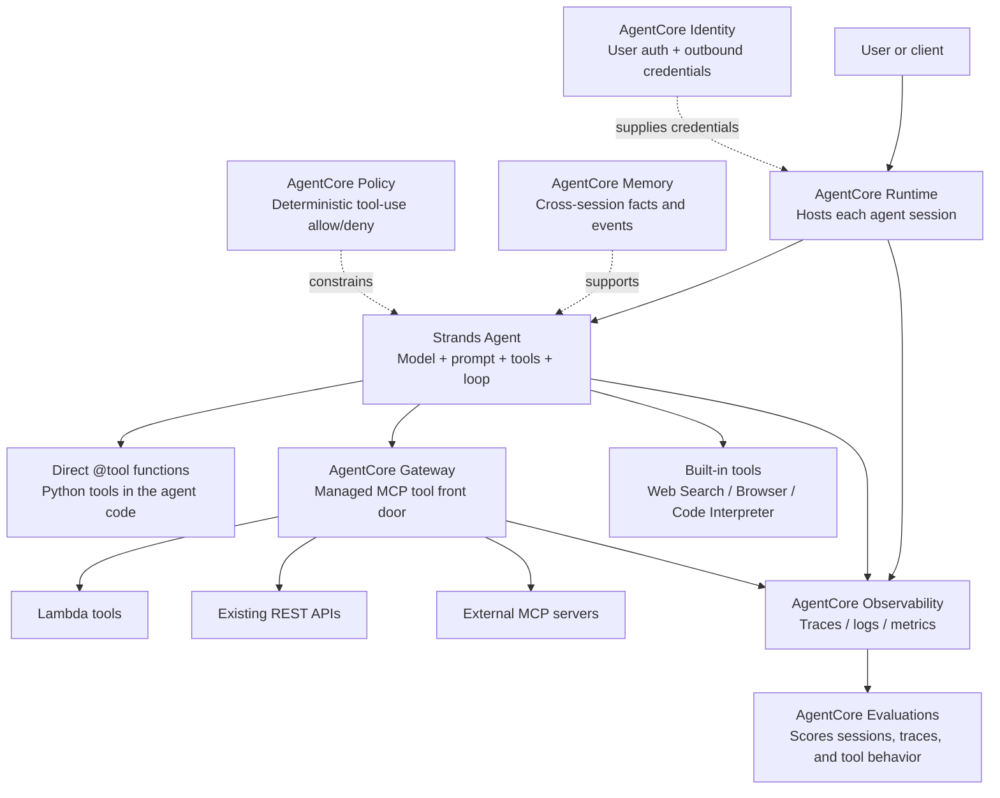

# AgentCore Architecture Notes

This document is the Week 1 architecture map for the AgentCore learning plan. It is not a design for a production app yet. The goal is simpler: understand which AgentCore service owns which part of an agent run, where tool behavior can fail, and where later evals will attach.

## The short version

A tool-calling agent has two layers:

1. **The agent loop** — the model reads the request, chooses a tool, builds arguments, receives the result, and writes the final answer.
2. **The platform around the loop** — hosting, tool exposure, credentials, policy, traces, memory, and evaluation.

Strands owns the local agent loop. AgentCore provides managed services around that loop so the same kind of agent can be hosted, governed, observed, and evaluated on AWS.

## Service map

## What each box owns

### Runtime

**Runtime hosts the agent.** It is the managed compute layer where Strands code runs after deployment. The key mental model is session isolation: each user session should run in its own isolated environment so users do not share state accidentally.

Runtime is not the agent framework. It does not decide which tool to call. It runs the code that does.

### Strands Agent

**The Strands agent is the loop.** It holds the system prompt, available tools, model configuration, and conversation state. When called, it lets the model either answer directly or request a tool call, then feeds tool results back into the conversation until the model produces a final answer.

The Week 1 `hello.py` trace shows the basic loop:

1. User asks a question.
2. Assistant emits `toolUse`.
3. Strands executes the tool and appends `toolResult`.
4. Assistant synthesizes the final response.

That trace is the seed of the later eval contract.

### Direct `@tool` functions

**A direct tool is a Python function exposed to the model.** In Strands, the `@tool` decorator turns a function into a model-visible capability. The function name becomes the tool name, the docstring becomes the tool description, and the type-hinted signature becomes the input schema.

This is why tool docstrings are not just comments. They influence tool selection.

### Gateway

**Gateway turns existing capabilities into governed MCP tools.** It can front Lambda functions, REST APIs, and existing MCP servers so an agent can call them through a managed tool endpoint.

Gateway is not where business logic magically appears. The Lambda, API, or MCP server still has to exist. Gateway is the managed tool boundary: describing, exposing, and controlling access to those tools.

### Built-in tools

**Built-in tools are managed capabilities supplied by AgentCore.** Examples include web search, browser, and code interpreter-style tools.

They are useful, but this learning plan mostly builds boring custom tools on purpose. The point is to evaluate tool selection and failure behavior, not to collect shiny tools like Pokémon.

### Memory

**Memory persists context across sessions.** It is for facts or events the agent should remember after the Runtime session ends.

Memory is different from the Runtime session state. Runtime state is temporary; Memory is durable. This distinction matters for evals because a model should not invent remembered facts unless the memory layer actually supplied them.

### Identity

**Identity handles user-level and outbound credentials.** It covers questions like: who is allowed to invoke the agent, and what external credentials can the agent use at runtime?

Identity complements IAM. IAM controls AWS permissions; Identity handles user auth and third-party/API credential flows around the agent.

### Policy

**Policy is deterministic control over agent-tool interactions.** It answers questions like: may this agent call this tool, with these arguments, in this context?

Policy is not the same as a content guardrail. A model can argue with a prompt, but it cannot argue with an enforced allow/deny rule. For eval work, Policy is where some failures should be prevented rather than merely detected after the fact.

### Observability

**Observability records what happened.** It captures traces, logs, and metrics from the Runtime, agent loop, and tool calls.

Observability does not judge correctness. It creates the evidence trail. Later evals depend on this evidence: selected tool, arguments, execution status, timing, and final answer.

### Evaluations

**Evaluations score agent behavior from traces and sessions.** AgentCore Evaluations can judge tool selection, tool parameter quality, session success, and other behavior using built-in or custom evaluators.

The important caveat: evaluations are measurements, not truth. They need calibration against human labels and deterministic checks before we trust them.

## Where failures show up

The useful way to read the diagram is by failure surface:

| Failure | Where it originates | Where we observe or control it |
| --- | --- | --- |
| Agent answers when it should refuse | Strands agent loop / prompt boundary | Trace + local eval + later Evaluations |
| Agent chooses the wrong tool | Model tool-selection step | Trace, deterministic gate, `ToolSelectionAccuracy`-style eval |
| Agent fabricates tool arguments | Parameter construction step | Tool-call schema, trace, parameter-accuracy eval |
| Tool fails or times out | Tool implementation / external API | Tool result, failure taxonomy, observability |
| Agent hides a tool failure | Synthesis step | Response contract + trace review |
| Agent calls a forbidden tool | Tool boundary | Policy / capability manifest / Gateway controls |
| Agent uses credentials it should not have | Credential boundary | Identity + IAM + scoped runtime role |
| Public artifact leaks private data | Repo/docs process | Public-safety scanning and review |

## MCP primer

MCP — Model Context Protocol — is the protocol for **agent-to-tool** integration.

An MCP server exposes capabilities such as tools, resources, and prompts. For this plan, tools matter most: a tool has a name, description, and JSON Schema input shape. A client agent can discover those tools and call them.

The important eval lesson: an MCP tool description is also prompt material. If tool descriptions are vague, misleading, or too broad, the model may select the wrong tool even when the code is correct.

Rule of thumb:

- **MCP tool:** deterministic capability the agent invokes.
- **Eval shape:** did the agent call the right tool with the right arguments, and did it handle the result honestly?

## A2A primer

A2A — Agent2Agent — is the protocol for **agent-to-agent** communication.

An A2A agent publishes an Agent Card that describes who it is, what it can do, and how to reach it. Other agents send it tasks and receive messages or artifacts as that task moves through a lifecycle.

The key distinction from MCP is autonomy. A tool executes a requested operation. An agent has its own model loop and can make decisions.

Rule of thumb:

- **MCP:** “Call this tool with these arguments.”
- **A2A:** “Ask this other agent to work on this task.”

That distinction changes evaluation. A tool call can be checked against a contract. A delegated agent needs coordination and task-quality evaluation.

## How this connects to the learning plan

Week 1 is only the map. Later weeks attach real artifacts to the seams in this diagram:

- Week 2: build the first real tool-using agent.
- Week 3: deploy the same pattern to Runtime.
- Week 4: compare direct tools, MCP tools, Gateway, and built-in tools.
- Week 5: turn informal tools into explicit contracts and capability manifests.
- Weeks 6–10: build datasets, traces, labels, deterministic gates, and calibrated judges.
- Later weeks: add reliability, CI gates, observability, policy, and multi-agent patterns.

The career-relevant point is not memorizing every AgentCore box. It is knowing how to make agent behavior inspectable: what tool was selected, why, with what arguments, what happened, and whether the final answer represented that honestly.
